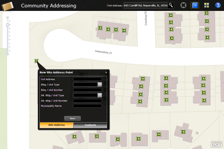

# address-crowdsourcing
(previously named community-addressing)

The Address Crowdsourcing application (previously named Community Addressing) is a configuration of ArcGIS and a JavaScript application that allows the general public to contribute missing site address locations and provide citizen contact information for current addresses.  This interactive web application includes a simple tool to review existing addresses and submit new address and contact information.

The application name change happened at the February 2015 release.

[Try the Address Crowdsourcing application](http://links.esri.com/localgovernment/tryit/AddressCrowdsourcing/)

## Features

* Search for an address
* Contribute missing address information
* Add contact information for an existing address

## Requirements

**Start now using Esri-supplied sample services**

You can start using the application now by setting it up on a web server running Microsoft Internet Information Services (IIS) and using sample services supplied by Esri.
You'll need to convert to an application in IIS and use the ASP .NET 4.0. application pool.

**Start now using your own services**

For more information on requirements and publication steps, see [Address Crowdsourcing application](http://links.esri.com/localgovernment/help/10.2/CommunityAddressing) help.

## Resources

Additional [information and sample data](http://www.arcgis.com/home/item.html?id=a1bed775a20c430f987573c02574e696) are available for the application.

Learn more about Esri's [ArcGIS for Local Government maps and apps](http://solutions.arcgis.com/local-government/).

Show me a list of other [Local Government GitHub repositories](http://esri.github.io/#Local-Government).

This application uses the 3.5 version of [Esri's ArcGIS API for JavaScript](http://help.arcgis.com/en/webapi/javascript/arcgis/); see the site for concepts, samples, and a reference for using the API to create mapping web sites.

[New to Github? Get started here.](http://htmlpreview.github.com/?https://github.com/Esri/esri.github.com/blob/master/help/esri-getting-to-know-github.html)

## Issues

Find a bug or want to request a new feature?  Please let us know by submitting an issue.

## Contributing

Esri welcomes contributions from anyone and everyone.
Please see our [guidelines for contributing](https://github.com/esri/contributing).

## Licensing

Copyright 2013 Esri

Licensed under the Apache License, Version 2.0 (the "License");
you may not use this file except in compliance with the License.
You may obtain a copy of the License at

   http://www.apache.org/licenses/LICENSE-2.0

Unless required by applicable law or agreed to in writing, software
distributed under the License is distributed on an "AS IS" BASIS,
WITHOUT WARRANTIES OR CONDITIONS OF ANY KIND, either express or implied.
See the License for the specific language governing permissions and
limitations under the License.

A copy of the license is available in the repository's
[LICENSE.txt](LICENSE.txt) file.

